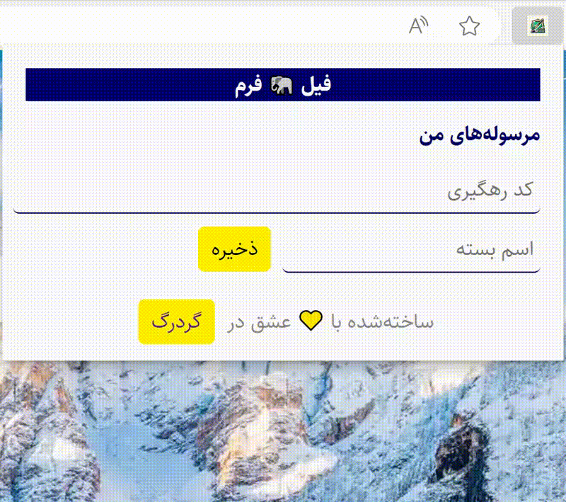

📦 برای کسایی که از سایت رهگیری مرسولات پستی خسته‌ان و می‌خوان لیست مرسولات پستی رو داخل مرورگر ذخیره کن، یه «فیل» کننده‌ی فرم ساختیم.

↘️⬇️⬇️⬇️⬇️⬇️⬇️⬇️⬇️⬇️⬇️↙️

➡️   [Download  کلیک، دانلود کنید](https://github.com/tayyebi/form_elephanter/raw/main/form_elephanter-main.crx)    ⬅️

↗️⬆️⬆️⬆️⬆️⬆️⬆️⬆️⬆️⬆️⬆️↖️

# Form Elephanter 🐘

A simple and convenient extension that helps you track your packets sent using delivery company.

## Features

- 🚚 Track the status and location of your packets in real time

## Future Features

- 📬 Get notifications when your packets are delivered or delayed
- 🌎 Support multiple delivery companies and countries
- 📊 Generate reports and statistics on your packet delivery performance
- 🔒 Secure and encrypted data storage and transmission

## Installation

To install Form Elephanter, follow these steps:

1. Download the latest release from the [GitHub page](https://github.com/your_username/packet-tracker/releases)
2. Extract the zip file and copy the folder to your preferred location
3. Open your browser and go to the extensions settings
4. Enable the developer mode and click on "Load unpacked"
5. Select the folder that contains the extension files
6. Enjoy tracking your packets!

## Usage

To use Form Elephanter, follow these steps:

1. Click on the extension icon in your browser toolbar
2. Enter your packet tracking number and select the delivery company
3. Click on "Track" and wait for the results
4. You can also view your tracking history, settings, and reports from the extension menu

## Contributing

Form Elephanter is an open source project and welcomes contributions from anyone who is interested. If you want to contribute, please follow these steps:

1. Fork the repository and clone it to your local machine
2. Create a new branch and make your changes
3. Push your changes to your fork and create a pull request
4. Wait for the review and feedback

## License

Form Elephanter is licensed under the [MIT License](https://github.com/tayyebi/form_elephanter/blob/main/LICENSE).

## Contact

If you have any questions, suggestions, or feedback, please feel free to contact me at info@gordarg.com.
